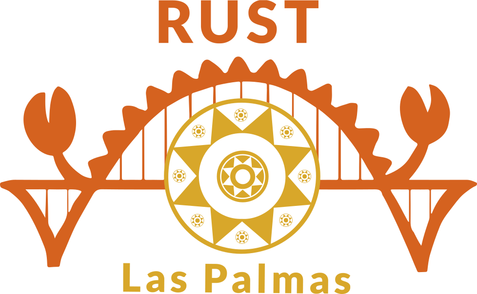

<a href="https://graphql.org/"></a>

# rust-gql-backend

> GraphQL backend in Rust — **async-graphql + axum + sqlx** — that emits the single
> `schema.graphql` contract.

<br clear="left"/>

Español: [README_ES.md](./README_ES.md)

A Rust port of the GofiGeeks GraphQL workshop backend. Serves queries, a multipart
upload mutation, subscriptions (SSE **and** WebSocket) and Better-Auth session auth
— all feature/config-driven. It **emits** `schema.graphql`, the contract shared by
every client.

## Workspace

- **`crates/api`** — lib (schema, data, transport, auth, storage) + bin `gql-api`.
- **`xtask`** — `emit-schema` + `diff` (the contract gate).
- **`xcheck`** — cross-contract check (a Leptos-equivalent request via graphql-client).

## Requirements

- Rust **1.95+**
- **Postgres** with the Better-Auth schema (only for DB-backed paths; `{ hello }`
  works without one)
- Secrets via `GQL_`-prefixed env vars (`config.toml` holds non-secret defaults)

## Run

```bash
# config: config.toml + GQL_ env (GQL_DATABASE__URL, GQL_AUTH__SESSION__SECRET, ...)
cargo run -p api                 # http://localhost:4000/graphql (+ GraphiQL on GET)

# emit + verify the contract
cargo run -p xtask -- emit-schema     # -> schema.graphql
cargo run -p xtask -- diff            # fails on breaking changes / staleness

cargo test --workspace
cargo clippy --workspace --all-targets -- -D warnings
```

## The ecosystem

| Repo | What it contributes |
|------|---------------------|
| [rust-gql-domain](https://github.com/rust-laspalmas/rust-gql-domain) | shared newtypes + validation (this crate depends on it) |
| **rust-gql-backend** (this) | the server; **emits** `schema.graphql` |
| [rust-gql-frontend](https://github.com/rust-laspalmas/rust-gql-frontend) | Leptos client that compiles against the emitted schema |
| [rust-gql-docs](https://github.com/rust-laspalmas/rust-gql-docs) | bilingual mdBook + rustdoc |

`schema.graphql` is the single contract: an incompatible change breaks the build of
every Rust consumer, and `xtask diff` catches it in CI.

---

<a href="https://rust-laspalmas.dev/"></a>

<br>

Part of the **GofiGeeks GraphQL → Rust** learning exploration by
[Rust Las Palmas](https://rust-laspalmas.dev) · [jesusperez.pro](https://jesusperez.pro).

Not a fork of the workshop — a companion.

<br clear="left"/>
